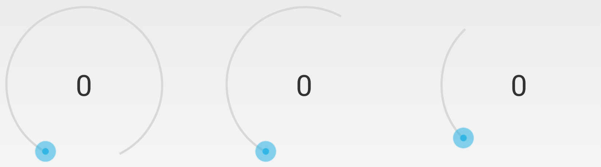
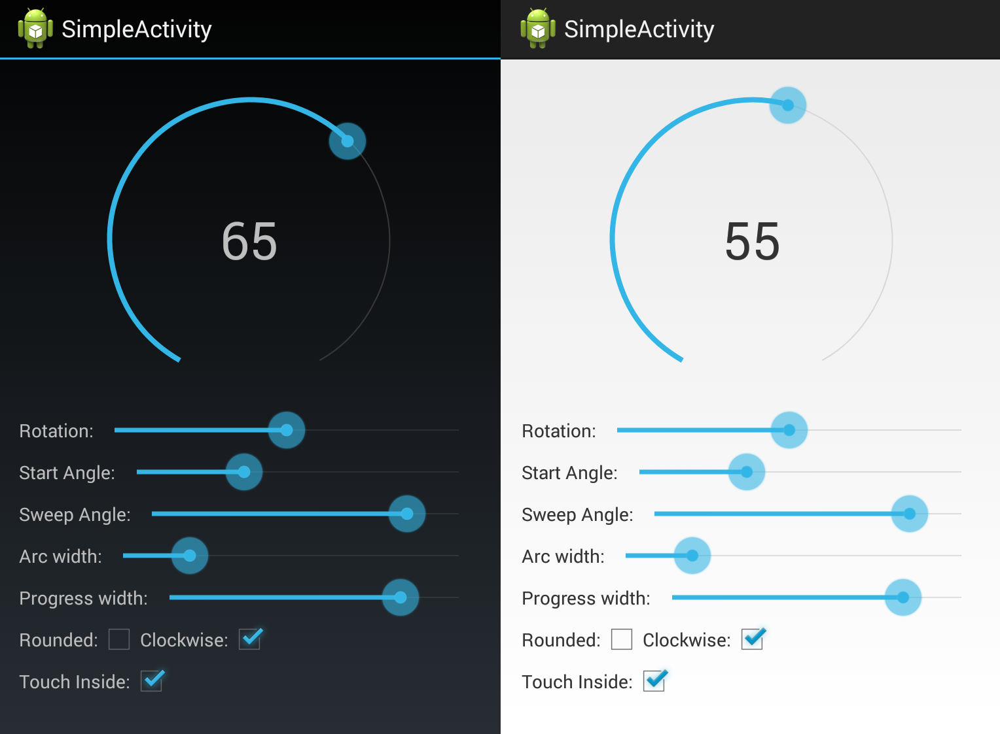

SeekArc
=======

# What is a SeekArc?

So what the heck is a SeekArc? Essentially it’s a SeekBar that has been wrapped around a circle. It acts like a SeekBar and generally has the same settings. You can even add a Listener to it as you would with a SeekBar. So if its in a circle why not call it a SeekCircle? The answer is that the SeekArc does have a few more setting than the SeekBar one of these is the sweepAngle, which means that the SeekArc doesn’t have to be drawn as a full circle, and can be drawn as a circle, semi-circle  or quarter arc or whatever you like. Supports min SDK 8. 

<div align="center">
  
</div>

[Video demo of the sample project](http://www.youtube.com/watch?v=MefE7mjM94M)

# Using the SeekArc

Using the SeekArc is straightforward. There are a number of settings from sweep angle to rotation that can be set. One of the less obvious settings is the radius or diameter of the SeekArc. When I developed the SeekArc I thought about adding an attribute for defining the diameter of the circle. In the end I decided against this. I thought a more flexible approach would be to allow the SeekArc to expand to the size of  its container layout. This way the SeekArc can grow in size with a layout that has widths or heights of match parent. Also it is still possible to set the SeekArc to a specific size by setting the container layouts width and height to specific dp values. This sizing approach gives the best of both worlds. To further adjust how the arc fits in its container a padding attribute can also be used.

To help with understanding how to use the SeeekArc I’ve put together a sample app with a number of controls that can be used to adjust the attributes of the SeekArc. This is by far the best way to get a good understanding of how to use the SeekArc. From the sample app you’ll see that it is possible to set attributes such as:

* Sweep angle
* Rotation
* Clockwise (which way do you want the progress to increase clockwise/anticlockwise),
* Arc and progress width
* Rounded corners 
* Touch inside enable/disable.
* Enabled - enables/disables touch and the thumbnail 


## To use it in your code

Simply add the View to your layout (There are several custom attributes) 

        <com.triggertrap.seekarc.SeekArc
            android:id="@+id/seekArc"
            android:layout_width="match_parent"
            android:layout_height="wrap_content"
            android:layout_gravity="center"
            android:padding="30dp"
            seekarc:rotation="180"
            seekarc:startAngle="30"
            seekarc:sweepAngle="300"
            seekarc:touchInside="true" />
            
            
## Adding to your project

This library is not yet released in Maven Central, until then you can add as a library module or use JitPack.io. 

Add remote maven url

```groovy
    repositories {
        maven {
            url "https://jitpack.io"
        }
    }
```
    
Now add a library dependency (remember to check for latest release)

```groovy
    dependencies {
        compile 'com.github.Triggertrap:SeekArc:v1.1'
    }
```


#Recent changes 

## Version 1.1
After a long hiatus we've recently integrated many of the PRs/changes submitted by others so a big thanks for all the contributions. We'll endevour to respond to PRs and updates quicker in future. The following changes have been included in v1.1.
 
* converted to gradle
* latest Android SDK/tools   
* removed dependency on color that holo blue that caused issues on API < 14. 
* changes to make compatible with scroll view changes including example in sample app
* added 'enabled' option that if set to false disables touch and visibility of the thumbnail  
* set color progress and arc programmatically
* mProgress typo
* fixed setting progress via xml 
* sample updates to show some of the new functionality
* readme and jitpack.io notes

## Version 1.0

* init release

# Sample Project

You can see the SeekArc working in the sample application. Just check out the library and sample application as two separate projects and import them into eclipse. Make sure that the Sample app is setup to correctly use the library project. The sample app will let you explore the attributes that can be set on the SeekArc. 

<div align="center">
  
</div>


# License

```

The MIT License (MIT)

Copyright (c) 2013 Triggertrap Ltd
Author Neil Davies 

Permission is hereby granted, free of charge, to any person obtaining a copy of
this software and associated documentation files (the "Software"), to deal in
the Software without restriction, including without limitation the rights to
use, copy, modify, merge, publish, distribute, sublicense, and/or sell copies of
the Software, and to permit persons to whom the Software is furnished to do so,
subject to the following conditions:

The above copyright notice and this permission notice shall be included in all
copies or substantial portions of the Software.

THE SOFTWARE IS PROVIDED "AS IS", WITHOUT WARRANTY OF ANY KIND, EXPRESS OR
IMPLIED, INCLUDING BUT NOT LIMITED TO THE WARRANTIES OF MERCHANTABILITY, FITNESS
FOR A PARTICULAR PURPOSE AND NONINFRINGEMENT. IN NO EVENT SHALL THE AUTHORS OR
COPYRIGHT HOLDERS BE LIABLE FOR ANY CLAIM, DAMAGES OR OTHER LIABILITY, WHETHER
IN AN ACTION OF CONTRACT, TORT OR OTHERWISE, ARISING FROM, OUT OF OR IN
CONNECTION WITH THE SOFTWARE OR THE USE OR OTHER DEALINGS IN THE SOFTWARE.

```
